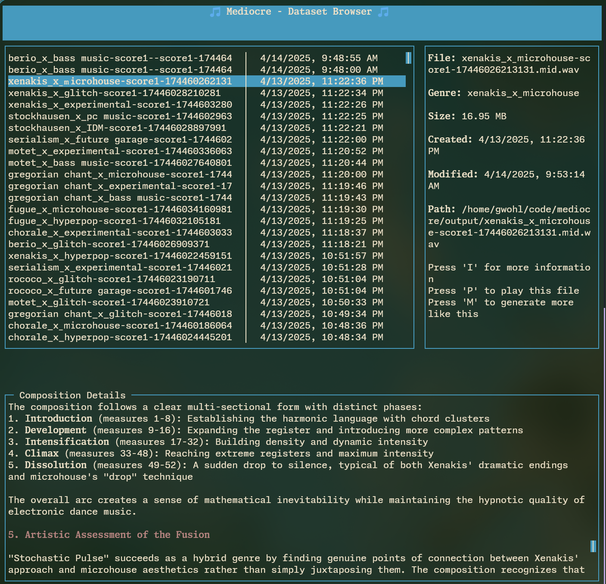

<div align="center">

# 🎵 MEDIOCRE-MUSIC 🎵

**Genre-bending AI music composition toolkit** for LLM training dataset creation.



[](https://www.npmjs.com/package/mediocre-music)
[](LICENSE)
[](https://nodejs.org)

</div>

> 🔊 **Create intricate, nuanced, and musically-sophisticated audio using our unique approach to LLM prompting for musical generation. Perfect for training LLM models on audio processing tasks like mixing, de-verbing, and effects processing.

## 🚀 Examples
[trombone.webm](https://github.com/user-attachments/assets/46cb7ad7-7d10-40ed-9cd5-aabb389450cc)

[berio.webm](https://github.com/user-attachments/assets/0926e777-8809-41e6-b963-464ed5f33a4f)

[pcmusic.webm](https://github.com/user-attachments/assets/bf2a1b1d-3582-4790-8b4b-8f40a7498944)

## ✨ Features

- 🎭 **Genre Fusion** - Combine classical and modern elements into unique hybrids
- 🤖 **AI Composition** - Generate ABC notation using Claude 3.7 Sonnet or Ollama
- 🎼 **Format Conversion** - ABC → MIDI → WAV pipeline with PDF scores
- 🎛️ **Audio Processing** - Apply reverb, delay, distortion and more
- 📊 **Dataset Building** - Create structured datasets for ML training
- 🖥️ **Interactive TUI** - Browse compositions with playback and rating system
- 🔄 **Model Flexibility** - Switch between Anthropic Claude and Ollama models
- 🔄 **Command Pipelines** - Run sequences of commands to automate complex workflows

## 🛠️ Installation

### Quick Start (CLI)

```bash
# Global installation
npm install mediocre-music -g

# Using Anthropic Claude
export ANTHROPIC_API_KEY=your_key_here

# OR Using Ollama (running locally)
export AI_PROVIDER=ollama
export OLLAMA_ENDPOINT=http://localhost:11434
export OLLAMA_MODEL=llama3
```

### Development Setup

```bash
# Clone and setup
git clone https://github.com/yourusername/mediocre.git
cd mediocre
npm install

# Create .env with your API key settings
# For Anthropic:
echo "ANTHROPIC_API_KEY=your_key_here" > .env

# OR for Ollama:
echo "AI_PROVIDER=ollama" > .env
echo "OLLAMA_ENDPOINT=http://localhost:11434" >> .env
echo "OLLAMA_MODEL=llama3" >> .env
```

## 📦 Requirements

- Node.js 18+
- AI Provider (choose one):
  - Anthropic API key (Claude 3.7 Sonnet recommended)
  - Ollama with a compatible model (llama3, mistral, etc.)
- External tools:
  - `abcmidi` - ABC ↔ MIDI conversion
  - `abcm2ps` & `ghostscript` - PDF score generation
  - `timidity` - MIDI → WAV conversion
  - `sox` - Audio effects processing

## 🎮 Usage Guide

> **Note:** All commands that work with existing music files (like `modify`, `mix-and-match`, `info`, `more-like-this`, etc.) accept direct file paths to ABC notation files, allowing precise control of which files to manipulate.

### Generate Wild Genre Hybrids

```bash
# Create 5 hybrid genres
mediocre genres -n 5

# Customize genre combinations
mediocre genres -c "baroque,serialist,minimalist" -m "techno,trap,vaporwave" -n 3
```

### Compose Musical Masterpieces

```bash
# Generate a composition for a specific hybrid
mediocre generate -g "Baroque_x_Techno" -c 1

# Generate multiple pieces with random hybrids
mediocre generate -C "baroque,classical" -M "techno,ambient" -c 3

# Use custom system prompt
mediocre generate -g "Renaissance_x_Trap" --system-prompt examples/custom-system-prompt.txt

# Use Ollama instead of Anthropic Claude
mediocre generate -g "Baroque_x_Techno" --ai-provider ollama --ollama-model llama3
```

### Process & Convert

```bash
# Convert ABC → MIDI → WAV
mediocre convert --to midi -d ./output
mediocre convert --to wav -d ./output

# Convert to WAV with individual instrument stems
mediocre convert --to wav -d ./output --stems

# Generate PDF scores
mediocre convert --to pdf -d ./output

# Add effects
mediocre process -d ./output -e reverb
```

### Modify Compositions

```bash
# Extend or transform existing pieces
mediocre modify "/path/to/baroque_x_jazz-score1-1234567890.abc" -i "Add a dramatic breakdown with harpsichord solo"
```

### Get Information About a Composition

```bash
# Display detailed information about a composition
mediocre info "/path/to/baroque_x_jazz-score1-1234567890.abc"
```

### Generate More Like an Existing Composition

```bash
# Create compositions similar to an existing one
mediocre more-like-this "/path/to/baroque_x_jazz-score1-1234567890.abc" -c 2 --solo
```

### Mix and Match Compositions

```bash
# Create a new composition by combining elements from multiple ABC files
mediocre mix-and-match -f "/path/to/first.abc" "/path/to/second.abc" --instruments "Piano,Violin,Synthesizer"
```

### Add Lyrics to a Composition

```bash
# Add lyrics to an existing MIDI file using a corresponding ABC file
mediocre lyrics -m "/path/to/composition.mid" -a "/path/to/composition.abc" -p "A song about the beauty of nature" --instruments "Piano,Vocals"
```

### Build ML Datasets

```bash
# Create structured dataset
mediocre dataset -d ./output
```

### Validate and Fix ABC Notation

```bash
# Process a single file
mediocre validate-abc -i "/path/to/composition.abc" -o "/path/to/fixed.abc"

# Process all ABC files in the output directory
mediocre validate-abc
```

### Run Command Pipelines

```bash
# Execute a sequence of commands defined in a JSON configuration file
mediocre pipeline -c "examples/pipeline-config.json"

# Run with specific AI provider
mediocre pipeline -c "examples/advanced-pipeline-config.json" --ai-provider anthropic
```

See [PIPELINE.md](docs/PIPELINE.md) for detailed documentation on creating pipeline configurations.

## 🎯 Hybrid Genre System

Mix and match from these *example* categories to create unique sonic fusions:

<table>
<tr>
<td width="50%" valign="top">

### 🎻 Classical/Traditional
- Baroque, Classical, Romantic
- Renaissance, Medieval, Impressionist
- Serialist, Minimalist, Neoclassical
- Opera, Cantata, Oratorio
- Chamber, Concerto, Ballet, Fugue

</td>
<td width="50%" valign="top">

### 🎧 Modern
- Techno, House, Drum and Bass
- Dubstep, Ambient, IDM, Glitch
- Vaporwave, Lo-fi, Chillwave
- Trap, Drill, Grime, Hip Hop
- Rock, Metal, Punk, Jazz, Funk

</td>
</tr>
</table>

Come up with your own crazy ideas and give them a try! I merged Cardi B and
John Zorn and I think it turned out really great.

## 🧠 How It Works

1. **Genre Fusion** - AI combines musical traditions into hybrid forms
2. **Composition** - AI (Claude or Ollama) creates ABC notation with abc2midi extensions
3. **Conversion** - Pipeline transforms notation into playable formats
4. **Processing** - Effects chain generates training pairs
5. **Dataset** - Organized structure with complete metadata

## Observations

Read [`OBSERVATIONS.md`](/OBSERVATIONS.md) for some helpful hints about how to most
effectively utilize the tool.

## 📁 Project Structure

```
mediocre/
├── src/              # Source code
│   ├── commands/     # Command implementations
│   ├── utils/        # Utility functions
│   └── index.js      # Entry point
├── output/           # Generated music files
├── dataset/          # Final processed dataset
└── temp/             # Temporary files
```

## 📄 License

MIT
