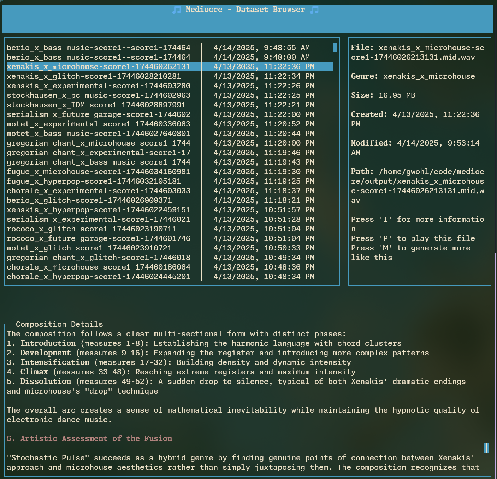

<div align="center">

# MEDIOCRE-MUSIC

**An AI that composes music by fusing genres that should never be combined.**



[](https://www.npmjs.com/package/mediocre-music)
[](LICENSE)
[](https://nodejs.org)

**[Listen to what it makes →](https://agrathwohl.github.io/mediocre/)**

</div>

---

Haydn crossed with Merzbow. Messiaen crossed with Burial. Babbitt crossed with Muslimgauze.

mediocre-music runs a coordinated pipeline of AI agents — composer, QA critic, orchestrator, drum arranger, soundfont selector, ornament specialist — that iteratively generate and refine compositions in ABC notation, then render them to MIDI and WAV. You control how long it runs and how weird it gets.

It's built as a training data generator for audio ML, but the output is genuinely interesting on its own.

---

## Hear It

**[Stochastic Voltage](https://agrathwohl.github.io/mediocre/media/stochastic-voltage-1767426307965.webm)** — Xenakis × Lightning Bolt

<video src="https://agrathwohl.github.io/mediocre/media/stochastic-voltage-1767426307965.webm" controls></video>

**[Ionisation Infinitum: Noise Architecture for Orchestral Machines](https://agrathwohl.github.io/mediocre/media/ionisation-infinitum-noise-architecture-for-orches-1771959392556.webm)** — Varèse × Merzbow

<video src="https://agrathwohl.github.io/mediocre/media/ionisation-infinitum-noise-architecture-for-orches-1771959392556.webm" controls></video>

**[Viennese Glitch Waltz](https://agrathwohl.github.io/mediocre/media/viennese-glitch-waltz-1768854783329.webm)** — Strauss × Oneohtrix Point Never

<video src="https://agrathwohl.github.io/mediocre/media/viennese-glitch-waltz-1768854783329.webm" controls></video>

**[Ride of the Hypercore Valkyries](https://agrathwohl.github.io/mediocre/media/ride-of-the-hypercore-valkyries-1767583620798.webm)** — Wagner × Speedcore

<video src="https://agrathwohl.github.io/mediocre/media/ride-of-the-hypercore-valkyries-1767583620798.webm" controls></video>

**[Partchcore Genesis](https://agrathwohl.github.io/mediocre/media/partchcore-genesis-1767859136656.webm)** — Harry Partch × Happy Hardcore

<video src="https://agrathwohl.github.io/mediocre/media/partchcore-genesis-1767859136656.webm" controls></video>

**[Full gallery with PDF scores and analysis →](https://agrathwohl.github.io/mediocre/)**

---

## Try It

```bash
npm install -g mediocre-music
export ANTHROPIC_API_KEY=your_key_here

mediocre generate \
  -C "Messiaen,Varese,Spectralism" \
  -M "Merzbow,Burial,Oneohtrix Point Never" \
  -s "Excessively Experimental" \
  --sequential --max-iterations 8 --stream-text
```

That's it. Walk away. Come back to rendered audio.

---

## What It Does

- **Genre fusion at scale** — give it any classical composers and modern artists, it figures out how to merge them
- **Multi-agent pipeline** — 10+ specialized agents (composer, QA critic, orchestrator, drum arranger, soundfont selector, ornamentation, MIDI expression, title guard, genre researcher) run in coordination
- **Iterative refinement** — the orchestrator scores each iteration and directs targeted improvements until the piece passes QA or hits your iteration limit
- **Human-in-the-loop** — `--interactive` mode lets you approve, reject, redirect, listen, or branch at every iteration
- **Full render pipeline** — ABC → MIDI → WAV → WebM, with PDF scores and structured JSON analysis for every piece
- **Soundfont-aware** — custom TiMidity configs per composition, soundfont selected per genre
- **Structured output** — composition agent uses Zod schemas to build valid ABC deterministically, not by hoping the LLM gets the syntax right
- **Dataset-ready** — everything outputs to structured JSON alongside the audio for ML training

---

## Install

```bash
npm install -g mediocre-music
```

**Requires:** Node.js 18+, `ANTHROPIC_API_KEY`, and these system tools:

```bash
# Ubuntu/Debian
apt install abcmidi abcm2ps ghostscript timidity fluidsynth sox ffmpeg

# macOS
brew install abcmidi abcm2ps ghostscript timidity fluidsynth sox ffmpeg

# NixOS
nix-shell -p abcmidi abcm2ps ghostscript timidity fluidsynth sox ffmpeg
```

---

## Key Flags

| Flag | What it does |
|------|-------------|
| `-C` | Classical composers/genres to fuse from |
| `-M` | Modern artists/genres to fuse from |
| `-s` | Style description |
| `--sequential` | Enable multi-agent orchestration loop |
| `--max-iterations N` | How many refinement cycles (default: 5) |
| `--interactive` | Pause at each iteration for human control |
| `--stream-text` | Watch the composition being written in real time |
| `-c N` | Generate N compositions |
| `--model <id>` | Use a different model (works with `--proxy-url` + `--api-key` for any provider) |

---

## More

Full CLI reference, architecture docs, advanced usage, and troubleshooting in **[DOCS.md](./DOCS.md)**.
