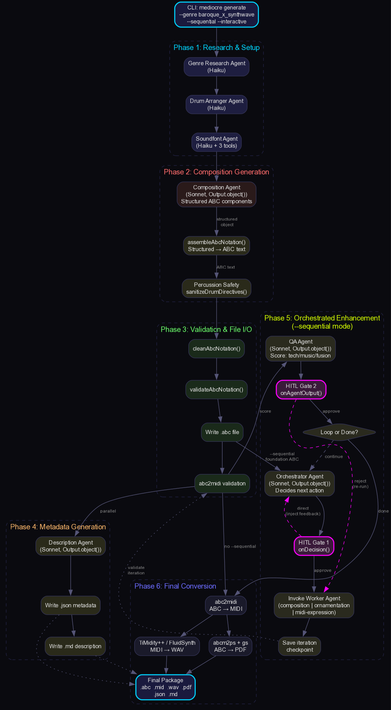
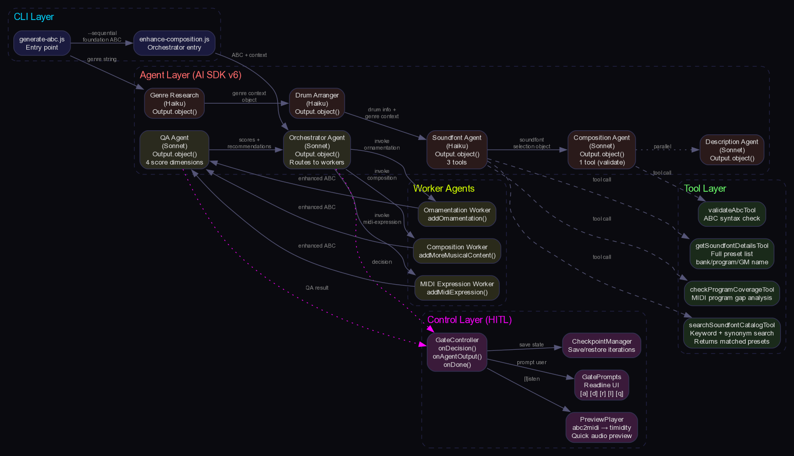
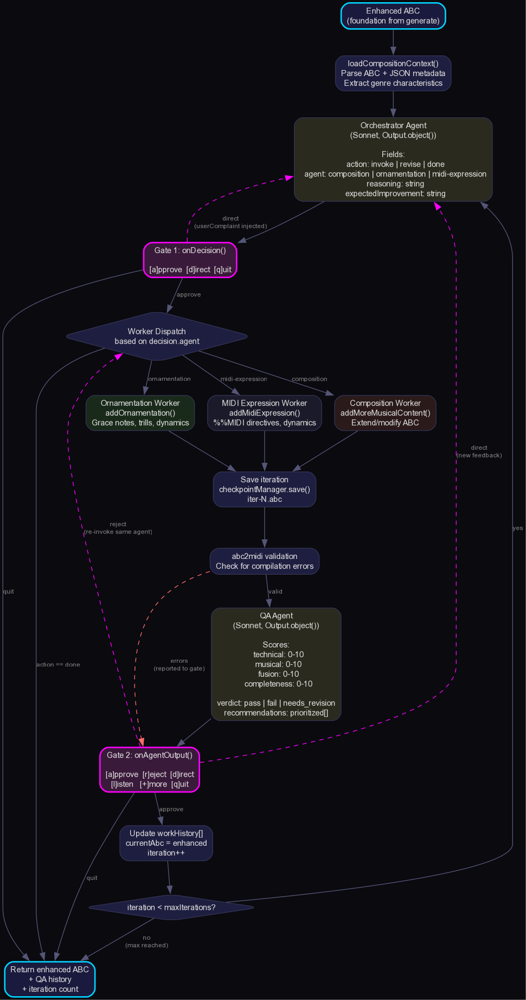
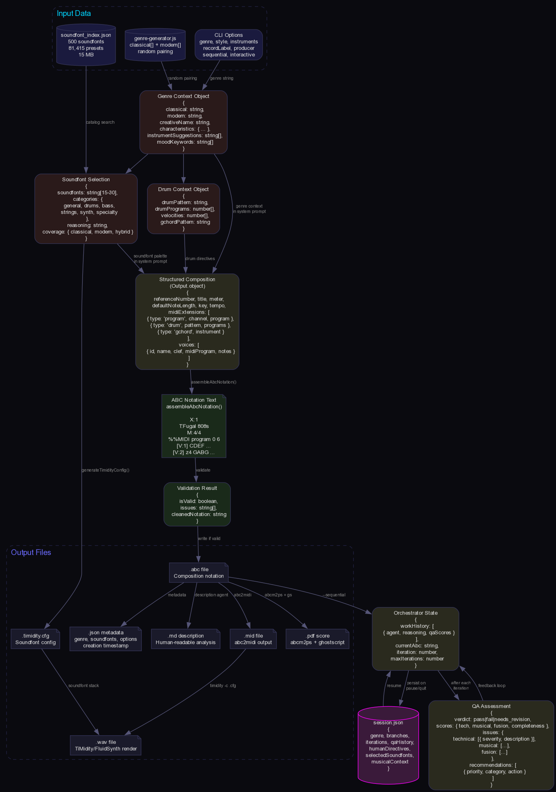

# Object-Mode Composition Workflow

**Canonical reference for the mediocre-music agentic composition pipeline using AI SDK v6 `Output.object()` structured generation.**

---

## Table of Contents

1. [Pipeline Overview](#pipeline-overview)
2. [Main Pipeline (25 Steps)](#main-pipeline-25-steps)
3. [Agent Architecture](#agent-architecture)
4. [Composition Agent — Structured Output](#composition-agent--structured-output)
5. [ABC Assembly](#abc-assembly)
6. [Orchestrator Enhancement Loop](#orchestrator-enhancement-loop)
7. [QA Agent — Scoring & Feedback](#qa-agent--scoring--feedback)
8. [Human-in-the-Loop Gate System](#human-in-the-loop-gate-system)
9. [Data Shapes at Each Stage](#data-shapes-at-each-stage)
10. [Key Source Files](#key-source-files)

---

## Pipeline Overview



The object-mode pipeline generates music compositions through a multi-agent system where the composition agent returns **structured JavaScript objects** (via AI SDK v6 `Output.object()` with Zod schemas) instead of raw text. These objects are then **assembled** into valid ABC notation by deterministic code — eliminating an entire class of formatting errors.

The pipeline has two major phases:

1. **Generation Phase** — CLI parsing → genre research → drum arrangement → composition agent → ABC assembly → validation → file output
2. **Enhancement Phase** (optional, `--sequential`) — orchestrator loop → worker agents (composition / ornamentation / midi-expression) → QA scoring → HITL gates → iteration until quality threshold met

---

## Main Pipeline (25 Steps)

The complete journey from CLI invocation to final output:

### Phase A: Generation

| Step | Action | Source |
|------|--------|--------|
| 1 | Parse CLI options (`--genre`, `--sequential`, `--interactive`, etc.) | `src/commands/generate-abc.js` L40-80 |
| 2 | Parse genre hybrid string into `classicalGenre` + `modernGenre` | `generate-abc.js` L82-95 |
| 3 | Generate creative composition/producer/label names | `generate-abc.js` L97-120 |
| 4 | **Genre Research Agent** — research both genres for authentic fusion context | `src/agents/genre-research/` |
| 5 | **Drum Arranger Agent** — prescribe GM drum kit with note mappings | `src/agents/drum-arranger/` |
| 6 | **Composition Agent** — generate structured object via `Output.object()` | `src/agents/composition/index.js` |
| 7 | `assembleAbcNotation()` — deterministic conversion of structured object → ABC string | `composition/index.js` L55-139 |
| 8 | `enforcePercVoiceNotes()` — safety net replacing unmapped percussion notes with rests | `composition/index.js` L141-178 |
| 9 | 3-pass error correction (if abc2midi reports errors, agent fixes them) | `composition/index.js` L720-780 |
| 10 | `cleanAbcNotation()` — strip markdown fences, fix common ABC issues | `src/utils/validation.js` |
| 11 | `validateAbcNotation()` — structural validation (headers, voices, key) | `src/utils/validation.js` |
| 12 | Write `.abc` file to disk | `generate-abc.js` L350 |
| 13 | **Description Agent** — analyze composition, generate metadata JSON | `src/agents/description/` |
| 14 | Write `.json` metadata file alongside `.abc` | `generate-abc.js` L380 |
| 15 | Write `.md` human-readable description | `generate-abc.js` L390 |

### Phase B: Enhancement (when `--sequential` is passed)

| Step | Action | Source |
|------|--------|--------|
| 16 | Load composition context from `.abc` + `.json` files | `src/utils/orchestrator-context.js` |
| 17 | **Orchestrator Agent** makes a decision: `done` or `invoke` (composition / ornamentation / midi-expression) | `src/agents/orchestrator/index.js` L46-160 |
| 18 | **Gate 1**: `onDecision()` — human approves, directs, or quits | `src/control/gate-controller.js` |
| 19 | Invoke chosen worker agent with orchestrator's directive | `orchestrator/index.js` L460-500 |
| 20 | Write iteration checkpoint `.abc` file | `orchestrator/index.js` L505 |
| 21 | `abc2midi` validation — catch compilation errors programmatically | `orchestrator/index.js` L508-530 |
| 22 | **QA Agent** — score the iteration (technical / musical / fusion / completeness / duration) | `src/agents/qa/index.js` |
| 23 | **Gate 2**: `onAgentOutput()` — human reviews scores, approves/rejects/directs | `gate-controller.js` |
| 24 | Loop back to step 17 (until `done`, max iterations, or human quits) | `orchestrator/index.js` L386-561 |

### Phase C: Post-Processing

| Step | Action | Source |
|------|--------|--------|
| 25 | Final ABC → `abc2midi` → MIDI → TiMidity/FluidSynth → WAV → `abcm2ps` → PDF | `generate-abc.js` L400-550 |

---

## Agent Architecture



Eight agents participate in the pipeline. Each is an AI SDK v6 `ToolLoopAgent` with specific tools and structured output schemas:

| Agent | Model | Purpose | Output Mode |
|-------|-------|---------|-------------|
| Genre Research | Sonnet | Research classical + modern genre characteristics | Text |
| Drum Arranger | Sonnet | Prescribe GM drum kit (instruments, note mappings, patterns) | `Output.object()` |
| **Composition** | Sonnet | Generate structured ABC composition components | `Output.object()` |
| Soundfont | Haiku | Select optimal soundfont stack for genre fusion | `Output.object()` |
| Description | Sonnet | Analyze composition, produce metadata | Text |
| **Orchestrator** | Sonnet | Decide next enhancement action | `Output.object()` |
| **QA** | Sonnet | Score composition quality across 5 dimensions | `Output.object()` |
| Ornamentation | Sonnet | Add stylistically appropriate ornaments | Text (ABC) |
| MIDI Expression | Sonnet | Add dynamics, expression, MIDI directives | Text (ABC) |

### Agent Dependency Graph

```
CLI
 └─► Genre Research Agent
      └─► Drum Arranger Agent
           └─► Composition Agent (uses genre context + drum prescription)
                ├─► Description Agent (parallel, post-generation)
                ├─► Soundfont Agent (parallel, for TiMidity config)
                └─► Orchestrator Agent (sequential enhancement)
                     ├─► Composition Agent (as worker)
                     ├─► Ornamentation Agent (as worker)
                     ├─► MIDI Expression Agent (as worker)
                     └─► QA Agent (after each worker invocation)
```

---

## Composition Agent — Structured Output

The composition agent is the heart of the pipeline. It uses `Output.object()` with a Zod schema to guarantee structurally valid output that can be deterministically assembled into ABC notation.

### Output.object() Schema

```javascript
// src/agents/composition/index.js L363-418

output: Output.object({
  schema: z.object({
    referenceNumber: z.number().describe('Reference number, typically 1'),
    title: z.string().describe('Composition title'),
    meter: z.string().describe('Time signature like 4/4, 3/4, 6/8'),
    defaultNoteLength: z.string().describe('Default note length like 1/8, 1/4'),
    key: z.string().describe('Key signature like C, Dm, Gmaj, Amin'),
    composer: z.string().optional().describe('Composer attribution'),
    tempo: z.string().optional().describe('Tempo like 1/4=120'),

    midiExtensions: z.array(z.discriminatedUnion('type', [
      z.object({
        type: z.literal('program'),
        channel: z.number().optional().describe('MIDI channel 1-16'),
        program: z.number().describe('MIDI program 0-127'),
      }),
      z.object({
        type: z.literal('drum'),
        pattern: z.string().describe('Drum pattern using d=hit, z=rest'),
        programs: z.array(z.number()).describe('GM drum numbers 35-81'),
        velocities: z.array(z.number()).describe('Velocities 0-127'),
      }),
      z.object({
        type: z.literal('gchord'),
        instrument: z.number().describe('Accompaniment instrument 0-127'),
      }),
      z.object({
        type: z.literal('drummap'),
        note: z.string().describe('ABC note letter for this drum sound'),
        midiPitch: z.number().describe('GM percussion MIDI number 35-81'),
      }),
      z.object({
        type: z.enum(['drumon', 'drumoff']),
      }),
      z.object({
        type: z.literal('channel'),
        channel: z.number().describe('MIDI channel 1-16'),
      }),
    ])).optional(),

    voices: z.array(z.object({
      id: z.string().describe('Voice ID like V1, melody, perc'),
      name: z.string().optional().describe('Voice display name'),
      clef: z.enum([
        'treble', 'bass', 'alto', 'tenor',
        'treble+8', 'treble-8', 'bass+8', 'bass-8', 'perc',
      ]).optional(),
      midiProgram: z.number().optional().describe('MIDI program 0-127 for this voice'),
      notes: z.union([z.string(), z.array(z.string())]),
    })),
  }),
}),
```

### What This Guarantees

By forcing structured output, the LLM **cannot**:

- Forget the `X:` reference number
- Emit malformed `%%MIDI` directives (the discriminated union enforces valid types)
- Use invalid clef names
- Mix up voice header syntax
- Produce unterminated strings or broken ABC structure

The schema acts as a **compile-time contract** between the LLM and the assembler.

---

## ABC Assembly

The `assembleAbcNotation()` function deterministically converts the structured object into a valid ABC notation string. No LLM involved — pure code.

### Assembly Logic

```javascript
// src/agents/composition/index.js L55-139

export function assembleAbcNotation(structured, options = {}) {
  const lines = [];

  // ── Header Block ──
  lines.push(`X:${structured.referenceNumber || 1}`);
  lines.push(`T:${structured.title || 'Untitled'}`);
  if (structured.composer) lines.push(`C:${structured.composer}`);
  lines.push(`M:${structured.meter || '4/4'}`);
  lines.push(`L:${structured.defaultNoteLength || '1/8'}`);
  if (structured.tempo) lines.push(`Q:${structured.tempo}`);
  lines.push(`K:${structured.key || 'C'}`);

  // ── Global MIDI Extensions ──
  for (const ext of (structured.midiExtensions || [])) {
    switch (ext.type) {
      case 'program':
        lines.push(`%%MIDI program ${ext.channel != null ? ext.channel + ' ' : ''}${ext.program}`);
        break;
      case 'drum':
        lines.push(`%%MIDI drum ${ext.pattern} ${ext.programs.join(' ')} ${ext.velocities.join(' ')}`);
        break;
      case 'gchord':
        lines.push(`%%MIDI gchord ${ext.instrument}`);
        break;
      case 'drummap':
        lines.push(`%%MIDI drummap ${ext.note} ${ext.midiPitch}`);
        break;
      case 'drumon':
        lines.push('%%MIDI drumon');
        break;
      case 'drumoff':
        lines.push('%%MIDI drumoff');
        break;
      case 'channel':
        lines.push(`%%MIDI channel ${ext.channel}`);
        break;
    }
  }

  // ── Voice Declarations ──
  for (const voice of structured.voices) {
    const parts = [`V:${voice.id}`];
    if (voice.name) parts.push(`name="${voice.name}"`);
    if (voice.clef) parts.push(`clef=${voice.clef}`);
    lines.push(parts.join(' '));
  }

  // ── Voice Bodies ──
  for (const voice of structured.voices) {
    lines.push(`[V:${voice.id}]`);
    if (voice.midiProgram != null) {
      lines.push(`%%MIDI program ${voice.midiProgram}`);
    }
    const noteContent = Array.isArray(voice.notes)
      ? voice.notes.join('\n')
      : voice.notes;
    lines.push(noteContent);
  }

  return lines.join('\n');
}
```

### Drum Map Table Builder

When the drum arranger agent prescribes a kit, the composition agent needs to know which ABC note letters map to which percussion sounds. `buildDrumMapTable()` converts the prescription into a lookup:

```javascript
// src/agents/composition/index.js L18-53

export function buildDrumMapTable(drumKit) {
  // Maps ABC note letters (C, D, E, F, G, A, B, c, d, e, ...)
  // to GM percussion MIDI numbers from the drum arranger output
  const noteLetters = ['C','D','E','F','G','A','B','c','d','e','f','g','a','b'];
  const table = {};

  for (let i = 0; i < drumKit.instruments.length && i < noteLetters.length; i++) {
    table[noteLetters[i]] = {
      gmNumber: drumKit.instruments[i].gmNumber,
      name: drumKit.instruments[i].name,
    };
  }
  return table;
}
```

### Percussion Safety Net

After assembly, `enforcePercVoiceNotes()` scans any voice with `clef=perc` and replaces note letters that don't appear in the drum map with rests. This prevents abc2midi from mapping unmapped notes to arbitrary percussion sounds:

```javascript
// src/agents/composition/index.js L141-178

export function enforcePercVoiceNotes(abcText) {
  // Find %%MIDI drummap directives to build allowed-notes set
  // For each [V:*] section with clef=perc, replace
  // any note letter NOT in the drummap with 'z' (rest)
}
```

---

## Orchestrator Enhancement Loop



The orchestrator is a meta-agent that decides **which worker agent** to invoke next and **what directive** to give it. It does NOT generate music itself — it reads the QA scores, work history, and human feedback, then makes a strategic decision.

### Decision Schema

```javascript
// src/agents/orchestrator/index.js L31-44

const orchestratorDecisionSchema = z.object({
  action: z.enum(['done', 'invoke']),
  reasoning: z.string().describe('Why this decision'),
  agent: z.enum(['composition', 'ornamentation', 'midi-expression']).optional(),
  directive: z.string().optional().describe('Specific instruction for the worker agent'),
  expectedImprovement: z.string().optional().describe('What this should improve'),
});
```

### Loop Structure

```
orchestratePostProcessing(options)
│
├── while (!stopped && iteration < maxIterations)
│   │
│   ├── orchestratorAgent(context) → decision
│   │   └── { action: 'done'|'invoke', agent?, directive?, reasoning }
│   │
│   ├── ── GATE 1: onDecision(decision, context) ──
│   │   └── Human: approve / direct / quit
│   │
│   ├── if (decision.action === 'done')
│   │   ├── ── GATE 2: onDone(abc, qa, iterations) ──
│   │   │   └── Human: approve (stop) / reject (override, keep going)
│   │   └── break
│   │
│   ├── Invoke worker agent (composition / ornamentation / midi-expression)
│   │   └── Agent receives: current ABC + directive + genre context
│   │
│   ├── Write checkpoint: output/{name}_iter{N}.abc
│   │
│   ├── abc2midi validation
│   │   └── If errors → programmatic gate forces composition agent next iteration
│   │
│   ├── QA Agent reviews new ABC
│   │   └── Returns: verdict, scores (5 dimensions), issues, recommendations
│   │
│   ├── ── GATE 3: onAgentOutput(newAbc, qaResult, iteration, context) ──
│   │   └── Human: approve / reject (discard iteration) / direct / quit
│   │   └── Can also: extend iterations (+N more)
│   │
│   └── iteration++
│
├── if (iteration >= maxIterations)
│   └── ── GATE 4: onMaxIterations(abc, qa, iterations) ──
│       └── Human: approve (accept best) / extend (+N more iterations)
│
└── Save session via buildSessionData()
```

### Programmatic Gates (No Human Involved)

Two automatic gates fire regardless of HITL mode:

1. **abc2midi Error Gate** — If `abc2midi` reports compilation errors, the orchestrator is forced to invoke the composition agent with a directive containing the error messages. This overrides whatever the orchestrator would have decided.

2. **Duration Gate** — If the QA agent flags high-priority duration issues (composition too short/long), the orchestrator is nudged toward the composition agent to fix structural problems before aesthetic ones.

---

## QA Agent — Scoring & Feedback

The QA agent evaluates each iteration across 5 scoring dimensions and returns structured recommendations.

### QA Output Schema

```javascript
// src/agents/qa/index.js L62-110

output: Output.object({
  schema: z.object({
    verdict: z.enum(['pass', 'fail', 'needs_revision']),

    scores: z.object({
      technical: z.number().describe('Technical quality 0-10'),
      musical: z.number().describe('Musical quality 0-10'),
      fusion: z.number().describe('Genre fusion authenticity 0-10'),
      completeness: z.number().describe('Completeness 0-10'),
      duration: z.number().describe('Duration appropriateness 0-10'),
    }),

    issues: z.object({
      technical: z.array(z.object({
        severity: z.enum(['critical', 'major', 'minor']),
        description: z.string(),
        location: z.string().optional(),
      })),
      musical: z.array(z.object({
        severity: z.enum(['critical', 'major', 'minor']),
        description: z.string(),
        location: z.string().optional(),
      })),
      fusion: z.array(z.object({
        severity: z.enum(['critical', 'major', 'minor']),
        description: z.string(),
        missingElement: z.string().optional(),
      })),
    }),

    strengths: z.array(z.string()),

    recommendations: z.array(z.object({
      priority: z.enum(['high', 'medium', 'low']),
      category: z.enum(['technical', 'musical', 'fusion', 'completeness', 'duration']),
      action: z.string(),
      expectedImprovement: z.string(),
    })),

    summary: z.string(),
  }),
}),
```

### How Scores Flow to the Orchestrator

The QA result is passed directly into the orchestrator's context for the next iteration:

```javascript
// orchestrator/index.js — context assembly

const context = buildOrchestratorContext({
  currentAbc,
  workHistory,          // Array of { iteration, agent, directive, qaScores }
  lastQaResult,         // Full QA output from previous iteration
  userComplaint,        // Human directive from gate (if any)
  genreCharacteristics, // From genre research agent
  musicalContext,       // Parsed from composition metadata
});
```

The orchestrator sees the **trend** of scores across iterations (via `workHistory`) and can detect regressions, plateaus, or which dimension needs the most attention.

---

## Human-in-the-Loop Gate System

The gate system provides interactive control over the orchestrator loop. In the current implementation, only **interactive mode** is supported (supervised mode is planned for later).

### GateController Class

```javascript
// src/control/gate-controller.js

export class GateController {
  constructor(options) {
    this.mode = options.mode || 'autopilot';
    this.checkpoints = [];
    this.prompts = new GatePrompts();
    this.previewPlayer = options.previewPlayer || null;
    this.checkpointManager = options.checkpointManager || null;
  }

  // Called after orchestrator makes a decision
  async onDecision(decision, context) {
    if (this.mode === 'autopilot') return { action: 'approve' };
    return this.prompts.promptDecision(decision, context);
  }

  // Called when orchestrator decides "done"
  async onDone(finalAbc, qaResult, iterations) {
    if (this.mode === 'autopilot') return { action: 'approve' };
    return this.prompts.promptFinalReview(finalAbc, qaResult, iterations);
  }

  // Called after a worker agent produces new ABC + QA scores it
  async onAgentOutput(newAbc, qaResult, iteration, context) {
    this.checkpoints.push({ iteration, abc: newAbc, qa: qaResult, timestamp: Date.now() });
    if (this.mode === 'autopilot') return { action: 'approve' };
    return this.prompts.promptAgentOutput(newAbc, qaResult, iteration, context);
  }

  // Called when max iterations reached without "done"
  async onMaxIterations(currentAbc, qaResult, iterations) {
    if (this.mode === 'autopilot') return { action: 'approve', extend: 0 };
    return this.prompts.promptMaxIterations(currentAbc, qaResult, iterations);
  }
}
```

### Gate Actions Available to the Human

| Action | Effect |
|--------|--------|
| **Approve** (`a`) | Continue to next step |
| **Reject** (`r`) | Discard this iteration, re-run agent with same directive |
| **Direct** (`d`) | Inject a musical directive (free text → `userComplaint`) |
| **Listen** (`l`) | Preview current ABC as audio (abc2midi → timidity) |
| **Compare** (`c`) | A/B listen: previous iteration vs current |
| **Extend** (`+`/`-`) | Increase/decrease remaining iterations |
| **Quit** (`q`) | Stop orchestration, keep best iteration |

### Gate Integration in the Orchestrator

The gates are injected via the `gateController` option:

```javascript
// src/commands/generate-abc.js — sequential enhancement wiring

const gateController = options.interactive
  ? new GateController({
      mode: 'interactive',
      previewPlayer: new PreviewPlayer(),
      checkpointManager: new CheckpointManager(outputDir),
    })
  : null;

await orchestratePostProcessing({
  abcFilePath,
  musicalContext,
  genreCharacteristics,
  maxIterations: options.maxIterations || 5,
  gateController,  // null = autopilot (no gates fire)
});
```

---

## Data Shapes at Each Stage



### Stage 1: CLI Options

```javascript
{
  genre: 'baroque_x_trap',
  classicalGenre: 'baroque',
  modernGenre: 'trap',
  sequential: true,
  interactive: true,
  maxIterations: 5,
  solo: false,
  instruments: null,
  recordLabel: 'Warp Records',
  producer: 'Metro Boomin',
}
```

### Stage 2: Genre Research Output

```javascript
{
  classicalContext: 'Baroque: counterpoint, basso continuo, terraced dynamics...',
  modernContext: 'Trap: 808 sub-bass, hi-hat rolls, triplet flow...',
  fusionGuidance: 'Fugal structures over 808 patterns, harpsichord with autotune...',
}
```

### Stage 3: Drum Arranger Prescription

```javascript
{
  instruments: [
    { name: 'Bass Drum 1', gmNumber: 36 },
    { name: 'Snare Drum 1', gmNumber: 38 },
    { name: 'Closed Hi-Hat', gmNumber: 42 },
    { name: 'Open Hi-Hat', gmNumber: 46 },
    // ... up to 14 instruments mapped to ABC note letters
  ],
  suggestedPatterns: 'Trap half-time with 808 glides...',
}
```

### Stage 4: Composition Agent Structured Output

```javascript
{
  referenceNumber: 1,
  title: 'Fugal 808s',
  meter: '4/4',
  defaultNoteLength: '1/8',
  key: 'Dmin',
  composer: 'mediocre-music',
  tempo: '1/4=140',
  midiExtensions: [
    { type: 'program', channel: 1, program: 6 },   // Harpsichord
    { type: 'program', channel: 2, program: 38 },   // Synth Bass
    { type: 'drummap', note: 'C', midiPitch: 36 },  // Kick
    { type: 'drummap', note: 'D', midiPitch: 38 },  // Snare
    { type: 'drumon' },
  ],
  voices: [
    {
      id: 'V1', name: 'Harpsichord', clef: 'treble',
      midiProgram: 6,
      notes: 'D2E2F2G2|A4 A2G2|...',
    },
    {
      id: 'perc', name: 'Drums', clef: 'perc',
      notes: '[CEG]2 [CE]2 [DG]2 [CE]2|...',
    },
  ],
}
```

### Stage 5: Assembled ABC String

```abc
X:1
T:Fugal 808s
C:mediocre-music
M:4/4
L:1/8
Q:1/4=140
K:Dmin
%%MIDI program 1 6
%%MIDI program 2 38
%%MIDI drummap C 36
%%MIDI drummap D 38
%%MIDI drumon
V:V1 name="Harpsichord" clef=treble
V:perc name="Drums" clef=perc
[V:V1]
%%MIDI program 6
D2E2F2G2|A4 A2G2|...
[V:perc]
[CEG]2 [CE]2 [DG]2 [CE]2|...
```

### Stage 6: QA Scoring

```javascript
{
  verdict: 'needs_revision',
  scores: { technical: 8, musical: 7, fusion: 6, completeness: 7, duration: 8 },
  issues: {
    fusion: [{ severity: 'major', description: 'Trap hi-hat rolls absent', missingElement: 'triplet hi-hats' }],
    // ...
  },
  recommendations: [
    { priority: 'high', category: 'fusion', action: 'Add 16th-note hi-hat patterns', expectedImprovement: 'Fusion score +2' },
  ],
  summary: 'Strong baroque counterpoint but trap elements need reinforcement.',
}
```

### Stage 7: Orchestrator Decision

```javascript
{
  action: 'invoke',
  reasoning: 'Fusion score 6/10 — trap rhythmic elements underrepresented.',
  agent: 'composition',
  directive: 'Add 16th-note hi-hat rolls and trap-style snare patterns to the perc voice...',
  expectedImprovement: 'Fusion score to 8+',
}
```

### Stage 8: Final Outputs

```
output/baroque_x_trap-Fugal_808s-1234567890/
├── baroque_x_trap-Fugal_808s.abc       # Final enhanced ABC notation
├── baroque_x_trap-Fugal_808s.mid       # MIDI file (via abc2midi)
├── baroque_x_trap-Fugal_808s.wav       # Audio (via TiMidity/FluidSynth)
├── baroque_x_trap-Fugal_808s.pdf       # Sheet music (via abcm2ps + ps2pdf)
├── baroque_x_trap-Fugal_808s.json      # Composition metadata
├── baroque_x_trap-Fugal_808s.md        # Human-readable description
├── baroque_x_trap-Fugal_808s.timidity.cfg  # Soundfont config
├── baroque_x_trap-Fugal_808s_iter1.abc # Iteration checkpoint
├── baroque_x_trap-Fugal_808s_iter2.abc # Iteration checkpoint
└── session.json                        # Full orchestration session log
```

---

## Key Source Files

| File | Lines | Role |
|------|-------|------|
| `src/agents/composition/index.js` | 924 | Composition agent, Output.object() schema, assembleAbcNotation(), drum map, perc safety, error correction |
| `src/agents/orchestrator/index.js` | 624 | Orchestrator agent, enhancement loop, 4 gate integration points, session persistence |
| `src/agents/qa/index.js` | 300 | QA agent, 5-dimension scoring schema, composition review |
| `src/agents/soundfont/index.js` | ~200 | Soundfont selection agent with enriched catalog tools |
| `src/agents/shared/tools.js` | 545 | Shared tools: searchSoundfontCatalog, getSoundfontDetails, checkProgramCoverage |
| `src/control/gate-controller.js` | 147 | GateController class, 4 hooks, checkpoint tracking |
| `src/control/gate-prompts.js` | ~250 | Readline-based interactive prompts for each gate |
| `src/control/preview-player.js` | ~100 | abc2midi → TiMidity preview playback |
| `src/control/checkpoint-manager.js` | ~120 | Iteration checkpoint save/restore |
| `src/control/session-persistence.js` | ~150 | Session state save/resume |
| `src/commands/generate-abc.js` | 597 | CLI pipeline: genre → research → drums → compose → validate → enhance |
| `src/commands/enhance-composition.js` | 136 | Standalone `mediocre enhance` command entry point |
| `src/utils/validation.js` | ~257 | ABC validation, cleaning, abc2midi invocation |
| `src/utils/generation.js` | ~1115 | Core generation functions, prompt assembly |
| `src/utils/soundfonts.js` | ~239 | Soundfont palette info, selection functions |
| `src/utils/llm-client.js` | 37 | Anthropic client factory |

---

## CLI Invocation Examples

### Basic generation (autopilot, single pass)

```bash
mediocre generate --genre "baroque_x_trap"
```

### Sequential enhancement with interactive gates

```bash
mediocre generate --genre "spectralism_x_footwork" \
  --sequential --interactive --max-iterations 10
```

### Standalone enhancement of existing composition

```bash
mediocre enhance output/spectralism_x_footwork-*.abc \
  --interactive --max-iterations 5
```

### Quick generation with producer/label styling

```bash
mediocre generate --genre "minimalism_x_drill" \
  --producer "Metro Boomin" --record-label "Warp Records" --solo
```

---

*Generated from source analysis of mediocre-music codebase. All code snippets are from actual source files, not approximations.*
